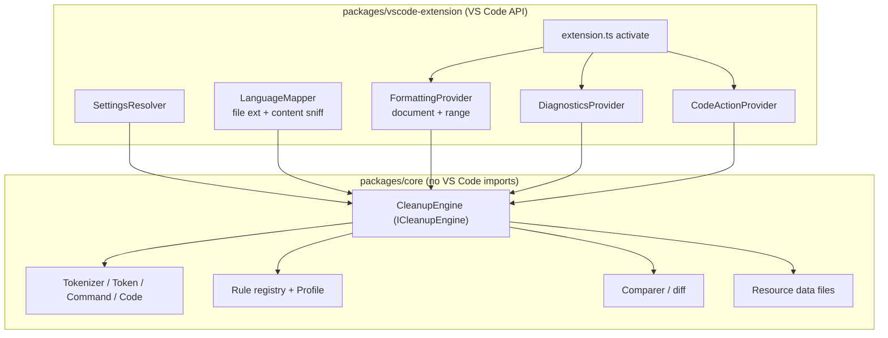

# 02 — Architecture

## Principle

The cleanup engine is a **pure, side-effect-free library** with zero VS Code API imports.
The extension host is a thin adapter. This is what makes the Rust swap cheap, and it is the
same separation the Java project already has (`com.sap.adt.abapcleaner` = engine,
`com.sap.adt.abapcleaner.gui` = UI).



## Package layout

```
packages/
  core/                        # the engine — publishable, portable, no vscode dep
    src/
      base/                    # ABAP.ts, DDL.ts, StringUtil.ts, Language.ts
      parser/                  # Token, Tokenizer, Command, Code, Term, CleanupRange
      rulebase/                # Rule, Profile, ConfigValue types, RuleID, RuleGroupID
      rulehelpers/             # shared analysis helpers
      rules/
        abap/{emptylines,spaces,declarations,syntax,commands,prettyprinter,alignment}/
        ddl/{annotations,position,spaces,alignment,emptylines}/
      comparer/                # diff, used for lint diagnostics
      api.ts                   # ICleanupEngine + DTOs — the stable boundary
    resources/                 # copied verbatim from the Java plugin (see below)
    test/
  vscode-extension/            # the .vsix
    src/
    package.json               # contributes.configuration generated, see 04
tools/
  gen-settings-schema.ts       # rule metadata -> package.json configuration
  import-java-fixtures.ts      # Java JUnit tests -> TS golden fixtures
spec/
```

## The engine boundary (`packages/core/src/api.ts`)

Everything crossing this boundary is plain serializable data — no classes, no callbacks, no
`vscode.*` types. That constraint is what allows the identical interface to be satisfied later by
WASM, where only structured-cloneable values can cross.

```ts
export type Language = 'ABAP' | 'DDL' | 'DCL' | 'SQLSCRIPT' | 'SQL' | 'GRAPH' | 'LLANG' | 'OTHER' | 'NOT_SUPPORTED';

export type ExpandMode = 'FULL_STATEMENT' | 'FULL_METHOD' | 'FULL_CLASS' | 'FULL_DOCUMENT';

export interface CleanupRequest {
  sourceText: string;
  language?: Language;          // omitted => engine sniffs via Language.preview()
  range?: { startLine: number; endLine: number };
  expandMode: ExpandMode;
  profile: ResolvedProfile;     // see 04-configuration.md
  abapRelease?: string;         // e.g. "757" — restricts syntax the rules may emit
  lineSeparator: '\n' | '\r\n';
}

export interface AppliedRule {
  ruleId: string;
  startLine: number;            // 1-based, in the ORIGINAL document
  endLine: number;
  displayName: string;
}

export interface CleanupResponse {
  cleanedCode?: string;
  errorMessage?: string;
  appliedRules: AppliedRule[];  // drives lint diagnostics
  stats: { changedLineCount: number; appliedRuleCount: number; processingTimeMs: number };
}

export interface ICleanupEngine {
  clean(request: CleanupRequest): CleanupResponse;
  listRules(): RuleMetadata[];  // drives settings schema generation
}
```

`CleanupResponse` mirrors `parser/CleanupResult.java` (`cleanedCode`, `errorMessage`,
`changedLineCount`, `appliedRuleCount`, `totalProcessingTime_ms`) with one addition:
`appliedRules[]` carrying per-rule line ranges. Upstream only aggregates this into a
`ruleStats` string for the UI; we need it structured to emit diagnostics.

## Process model

**In-process, synchronous, in the extension host.** No daemon, no child process, no LSP server.

Rationale: upstream cleans ~500 KB/s, and ABAP source files are small. A `DocumentFormattingEditProvider`
may return a `Promise`, so the call is wrapped in a microtask and can move to a worker later if
profiling demands it. This removes the entire `BinaryManager`/`DaemonClient` layer the SAP
extension needs, and it makes the extension work in remote and web contexts.

Debouncing applies to lint diagnostics only (on change, trailing edge), not to formatting.

## Resource data files

Several rules depend on data files shipped in `com.sap.adt.abapcleaner/resources/`. These are
copied verbatim into `packages/core/resources/` and loaded as plain text:

| File | Consumed by |
|---|---|
| `frequent_typos_english.txt` | `TYPO`, `DDL_TYPO` |
| `frequent_words_english.txt`, `frequent_words_german.txt`, `frequent_british_english.txt` | `TYPO`, `ABAP_DOC_LANG` |
| `camel_case_field_names.txt`, `camel_case_view_names.txt` | `CAMEL_CASE_NAME`, `DDL_CAMEL_CASE_NAME`, `CAMEL_CASE_IN_CDS_TEST` |
| `pseudo_comments.txt` | `PSEUDO_COMMENT` |
| `grammar.txt` | `ABAP_DOC_LANG` |

Loading must go through an injected reader rather than `fs` directly, so the same code runs under
WASM and in the web extension host.

## Error handling

Upstream's contract: **only modify statements that match expected syntax; leave anything
unexpected unchanged.** Ported literally — `UnexpectedSyntaxBeforeChanges` aborts a single rule on
a single command and continues; `UnexpectedSyntaxAfterChanges` aborts the whole cleanup and
returns the original text with an `errorMessage`. The formatter must **never** return a partially
mangled document.
