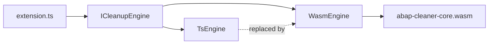

# 07 — Rust Migration Path

The TypeScript engine is the deliverable. This document records the constraints that keep a Rust
replacement cheap, so that they are respected from day one rather than retrofitted.

Refer to [Biome](https://github.com/biomejs/biome) as reference on how to use Rust as a formatter.

## Target shape

A `abap-cleaner-core` Rust crate compiled to `wasm32-unknown-unknown` and loaded via
`wasm-bindgen`, exposing the same `ICleanupEngine`. WASM over a native N-API addon because:

- one artifact for all platforms — no per-platform VSIX matrix (the reference extension ships
  four),
- works in the web extension host and in restricted/remote environments,
- no native toolchain in CI beyond `cargo` + `wasm-pack`.

Native N-API stays available as an optional fast path if WASM throughput disappoints; the
interface does not change either way.

`createEngine()` is the only factory; it picks the implementation from a setting
(`abapCleaner.engine: "typescript" | "wasm"`) during the transition, defaulting to `typescript`
and flipping once parity is proven.

## Constraints on the TypeScript engine

These are binding design rules, enforced in review:

1. **No VS Code imports in `packages/core`.** Lint rule, not convention.
2. **Boundary types are plain data.** No classes, functions, `Map`, `Set`, `Date`, or cyclic
   references in `CleanupRequest`/`CleanupResponse`. Everything must survive JSON
   serialization, because that is what crosses the WASM boundary.
3. **No `fs`, `path`, `process`, or `os` in core.** Resource files are supplied through an
   injected reader interface; the host decides where bytes come from.
4. **Synchronous engine API.** `clean()` returns a value, not a `Promise`. WASM calls are
   synchronous; an async TS API would not be replaceable one-for-one.
5. **Explicit integer semantics.** No reliance on JS number coercion where Rust would use `i32`/
   `usize`. Indices are non-negative integers; `-1` sentinels from Java are converted to
   explicit `undefined` at the boundary.
6. **UTF-16 vs UTF-8 offsets.** VS Code positions are UTF-16 code units; Rust strings are UTF-8
   bytes. All offsets crossing the boundary are **line/character pairs**, never byte or code-unit
   offsets, so the conversion problem never arises. This is why `CleanupRequest.range` uses lines
   rather than an absolute offset, unlike Java's `CleanupResult.offset`/`length`.
7. **Shared test fixtures.** The JSON fixtures from [06-testing.md](06-testing.md) are
   language-agnostic and become the Rust crate's test corpus verbatim. The Rust port is validated
   by the same files, so parity is measurable from the first rule.

## Rust structural notes

The parser's mutable doubly-linked `Token`/`Command` graph does not translate to safe Rust
directly. The intended shape:

- arena allocation — `Vec<Token>` with `u32` indices instead of pointers,
- `prev`/`next`/`parent`/`firstChild` become `Option<TokenIdx>`,
- rules take `&mut Code` and operate through index accessors.

Keeping the TS port faithful to the linked structure is *not* in conflict with this: the TS
accessors (`token.getNext()`, `token.getParent()`) become the exact seam where the arena
indirection is introduced. Rules written against those accessors port unchanged.

## Migration order

Per-rule, not big-bang. Once the rule registry can hold a mix of TS and Rust rules — or, more
simply, once the Rust engine passes the same fixture set for a whole rule group — that group flips
over. The group boundaries from [03-engine-port.md](03-engine-port.md) are the migration units.

Parity is declared when the Rust engine passes 100% of the committed fixtures and the
differential runner shows zero diffs on the L3 corpus.
